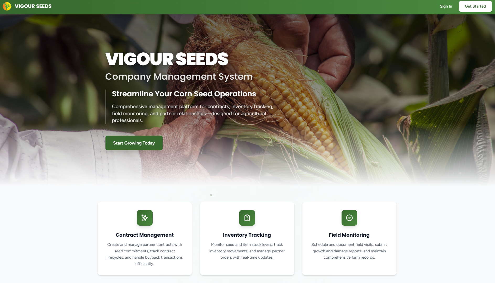
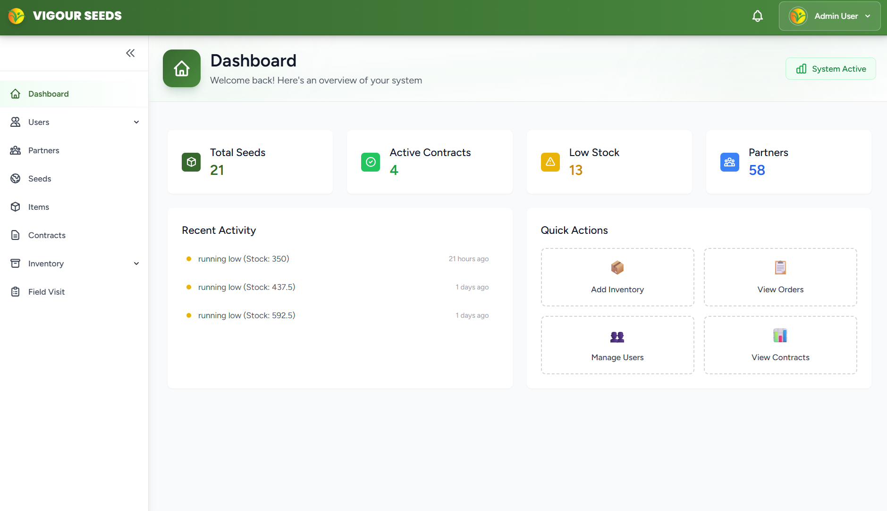
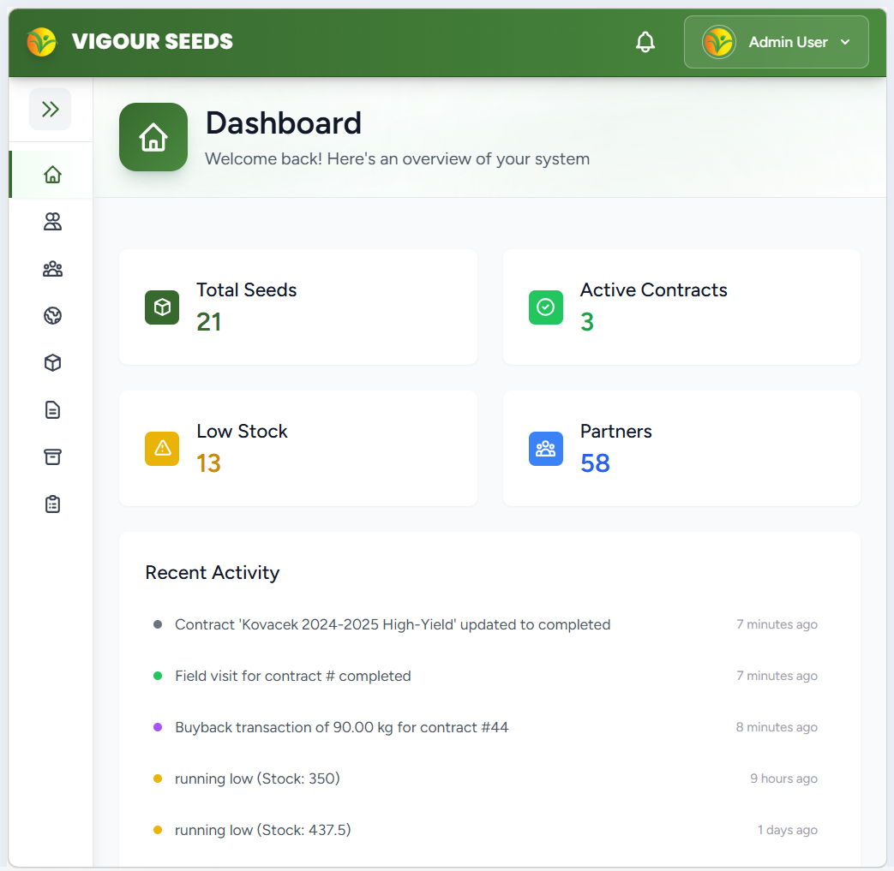
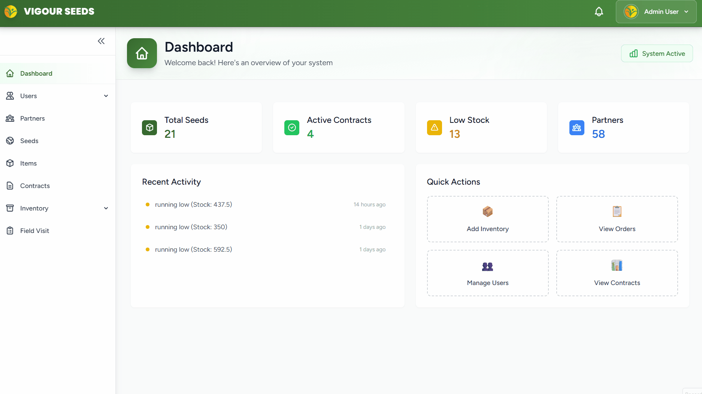
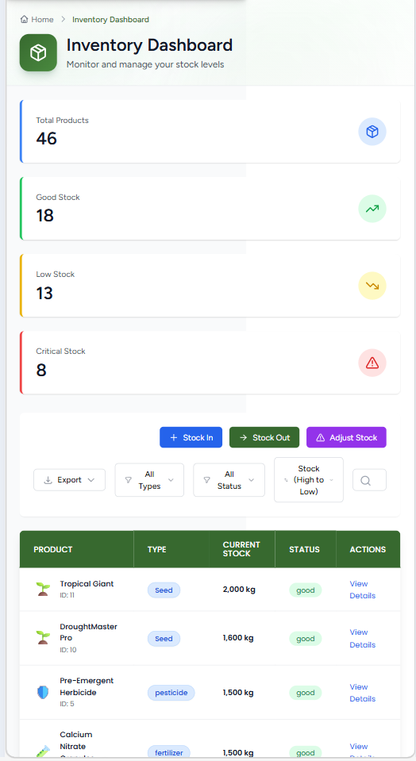
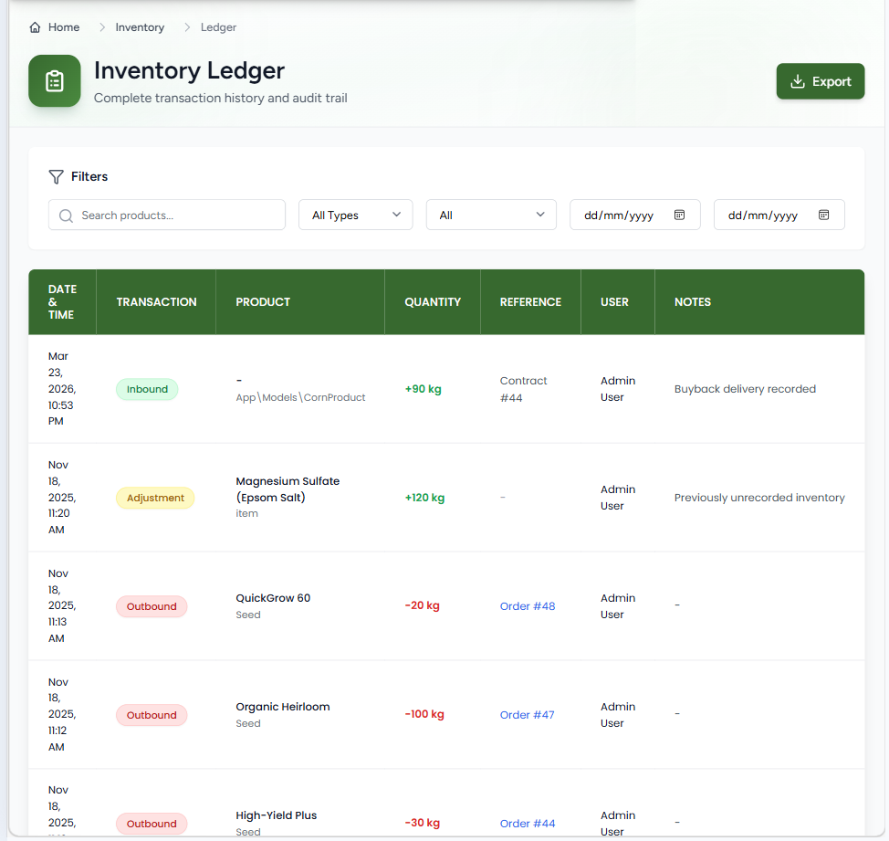

<br />
<div align="center">
  <a href="https://github.com/GreeceA/vigour-seeds-cms">
    
  </a>

  <h3 align="center">Vigour Seeds: Enterprise Contract Management System</h3>

  <p align="center">
    A comprehensive, end-to-end platform modernizing agricultural supply chains, contract lifecycles, and field operations.
    <br />
    <a href="ROLES-PERMISSIONS-GUIDE.md"><strong>Explore the Role Guide »</strong></a>
    <br />
    <br />
  </p>
</div>

<div align="center">
  
  
  
  
  
</div>

---



## 📖 About the Project

**Vigour Seeds Development Inc.** is a leading company in the agriculture industry, specializing in food production, crop farming, and agricultural research and development. To support their expanding operations, they required a centralized digital solution to replace fragmented workflows. 

The **Vigour Seeds Contract Management System** is a modern, web-based platform engineered to act as the company's central nervous system. It centralizes contract management, partner relationships, seed cataloging, inventory, and field activities, empowering staff with intelligent tools for efficient and transparent workflows.

> **💡 Note for Recruiters:** This project demonstrates complex state management, highly secure Role-Based Access Control (RBAC), and full-stack integration using modern SPA architecture.

---

## 📸 System Previews

### 📊 Real-Time Dashboard
*A centralized hub providing visual analytics and immediate overviews of active contracts, inventory thresholds, and recent system activities.*



### 📝 Contract Lifecycle Management
*End-to-end tracking of agricultural contracts including drafting, multi-stage reviews, activation, suspension, completion, and buyback transactions.*


### 📱 Responsive UI & Field Operations
*Scheduling and monitoring tools built with Tailwind CSS for field officers to log farm inspections on any device.*


---

## ✨ Key Modules & Features

* **Contracts:** Full lifecycle management (Draft → Review → Active → Suspended → Completed), including integrated buyback transactions.
* **Partners:** Manage partner organizations, farm locations, and contact persons with role-based access for managers and viewers.
* **Seeds:** Comprehensive seed catalog management encompassing creation, editing, pricing, optimal growth cycles, and soil compatibility requirements.
* **Inventory:** Real-time logistics tracking for seed and item stocks, inbound/outbound warehouse transactions, and fulfillment of partner orders.
* **Field Visits:** Automated scheduling and monitoring tools for farm inspections and activity reports.
* **Automated Reporting:** One-click PDF report generation for contracts, seed inventory audits, user logs, and field visit records.

---

## 🔐 Security & Role-Based Access Control (RBAC)

The system employs strict, fine-grained permissions to ensure data integrity and separation of duties across **11 distinct organizational roles**.

| Role Category | System Access & Responsibilities |
| :--- | :--- |
| **System Admin** | Full root access to all modules, system configuration, and user management. |
| **Contract Manager** | Oversees the complete contract lifecycle and coordinates required field visits. |
| **Partner Manager** | Manages partner organization profiles, farm locations, and contact personnel. |
| **Inventory Manager** | Oversees warehouse operations, stock levels, and transaction approvals. |
| **Seed Manager** | Maintains the integrity and updates of the centralized seed catalog. |
| **Field Officer** | Accesses assigned schedules to conduct, document, and submit farm inspections. |
| **Employee (Base)** | Limited, read-only view of essential company data based on departmental assignment. |

*For a detailed breakdown of all 11 roles and their specific module permissions, please see our comprehensive [ROLES-PERMISSIONS-GUIDE.md](ROLES-PERMISSIONS-GUIDE.md).*

---

## 🚀 Getting Started

*(Add instructions here if you want to show recruiters how to run the project locally)*

### Prerequisites
* PHP >= 8.1
* Composer
* Node.js & npm
* MySQL

### Installation

1. Clone the repo
   ```sh
   git clone [https://github.com/GreeceA/vigour-seeds-cms.git](https://github.com/GreeceA/vigour-seeds-cms.git)

2. Install PHP dependencies
   ```sh
   composer install

3. Install NPM packages
   ```sh
   npm install && npm run build

4. Configure environment variables
   ```sh
   cp .env.example .env
    php artisan key:generate

5. Run migrations and seed the database
   ```sh
   php artisan migrate --seed